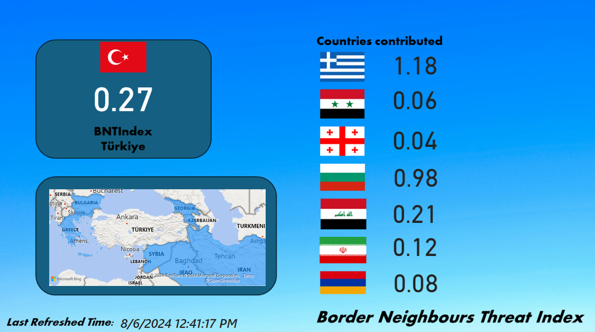

# bnti
Border Neighbours Threat Index

NOTE: This program does not have any kind of political meaning. It only is used as educational purposes.

Border Neighbours Threat Index is an index that analyzes countries' news and classify if they are negative.

That Python program firstly pulls news from RSS feeds of each country's news websites.
It is based on Türkiye's BNTIndex so therefore there are Iran, Iraq, Greece, Egypt, Syria, Bulgaria, Russia, Ukraine, Azerbaijan and Armenia.
I am planning to add more countries' BNTIndex, it is an initial version.

This program needs to be developed in these ways:

  <ul>
  <li> Looking for more serious news that can actually be considered as a threating. Otherwise, internal news are not threating for other countries. </li>
  <li> Economical reactions can be added as multiplier, such as increased gold prices. </li>
  <li> Instead of text classification, open sources AI would be added. </li>
  <li> Initial analysis should be added too, for example, both Türkiye and Greece are NATO countries and their threat scores should be lowered. </li>
  </ul>

